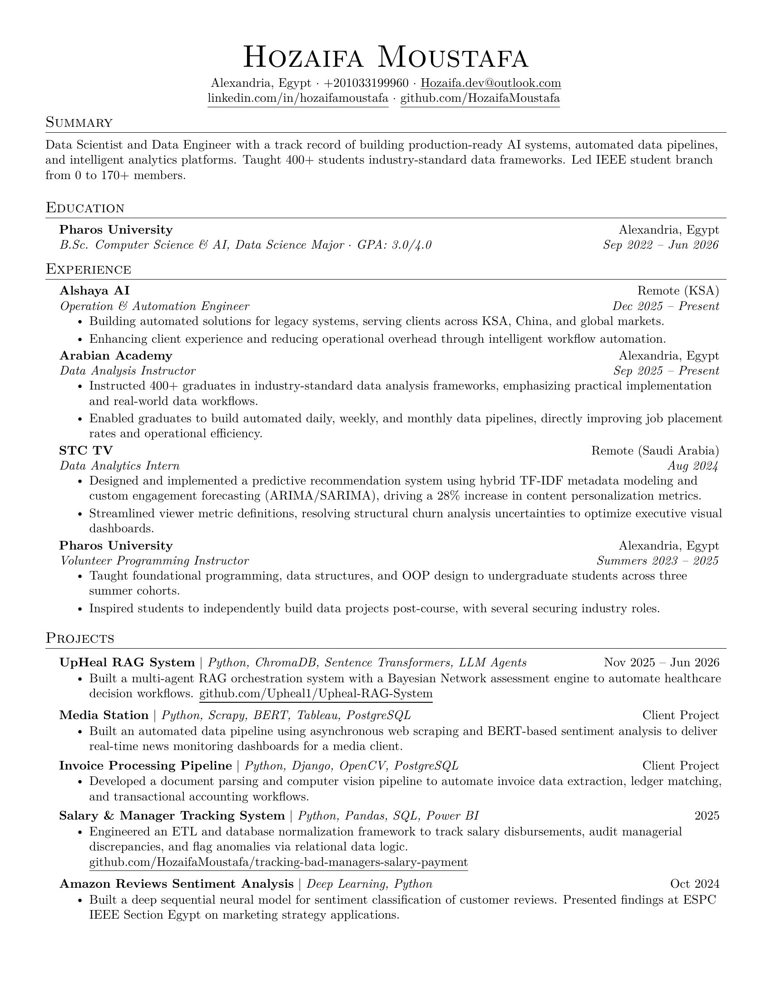

# LaTeX Resume Template

A clean, professional LaTeX resume template. Fork this repo and build your own resume in minutes.

---

## Preview



See [`hozaifamoustafa_resume.pdf`](hozaifamoustafa_resume.pdf) for the full PDF.

---

## Getting Started

### 1. Fork or Clone

```bash
git clone https://github.com/HozaifaMoustafa/hozaifamoustafa-resume-latex.git
cd hozaifamoustafa-resume-latex
```

### 2. Install LaTeX

- **Windows:** [MiKTeX](https://miktex.org/) or [TinyTeX](https://yihui.org/tinytex/)
- **macOS:** [MacTeX](https://www.tug.org/mactex/)
- **Linux:** `sudo apt install texlive-full`

### 3. Edit the Template

Open [`hozaifamoustafa_resume.tex`](hozaifamoustafa_resume.tex) and replace the placeholder content with your own:

- Name & contact info
- Education
- Work experience
- Skills
- Projects

### 4. Compile

```bash
pdflatex hozaifamoustafa_resume.tex
```

This generates `hozaifamoustafa_resume.pdf`.

---

## Project Structure

```
.
├── hozaifamoustafa_resume.tex           # Main resume source (edit this)
├── hozaifamoustafa_resume.pdf           # Compiled output
├── hozaifamoustafa_resume_preview.png   # README preview image
├── LICENSE              # MIT License
└── README.md            # This file
```

---

## Why No Dates in Filenames?

**You do not need to rename files with dates** (e.g., `Resume_Jan2026.tex`, `Resume_Jun2026.tex`).

Git already tracks every change automatically:

```bash
# See full history of your resume
git log -- hozaifamoustafa_resume.tex

# See what changed in a specific commit
git show <commit-hash>

# Tag a milestone version (e.g., before a job application)
git tag v2026.06.22
git push origin v2026.06.22
```

Using dated filenames:
- Creates clutter
- Makes it harder for others to use as a template
- Defeats the purpose of version control

Keep one stable filename (`hozaifamoustafa_resume.tex`) and let Git handle the history.

---

## License

[MIT](LICENSE) - Feel free to use, modify, and share.
